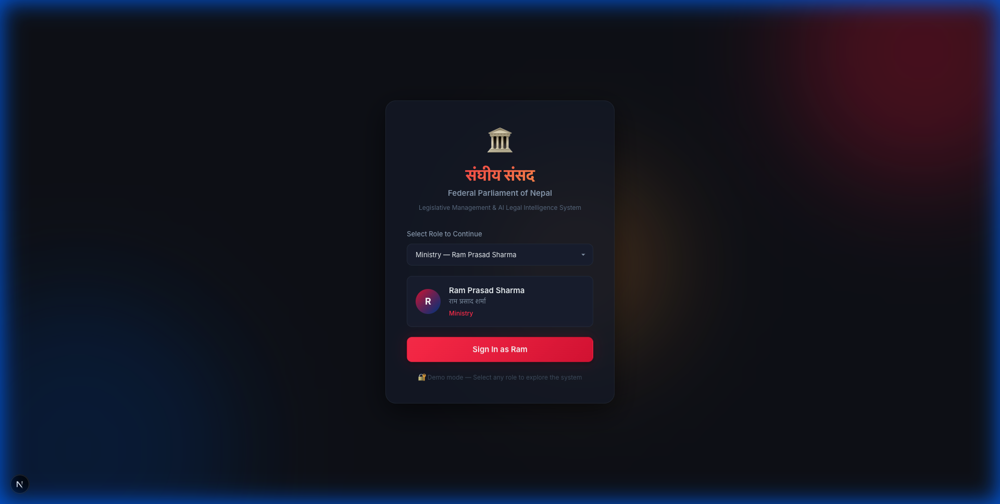
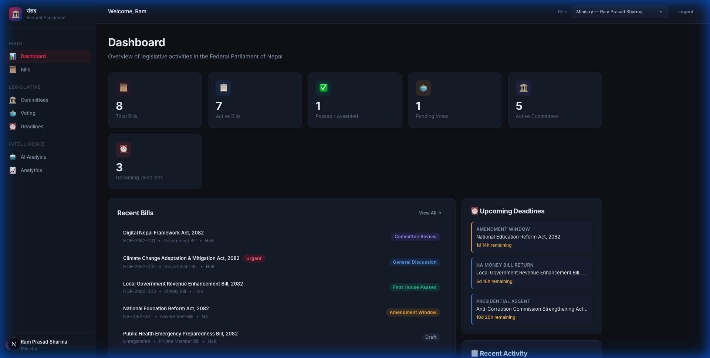
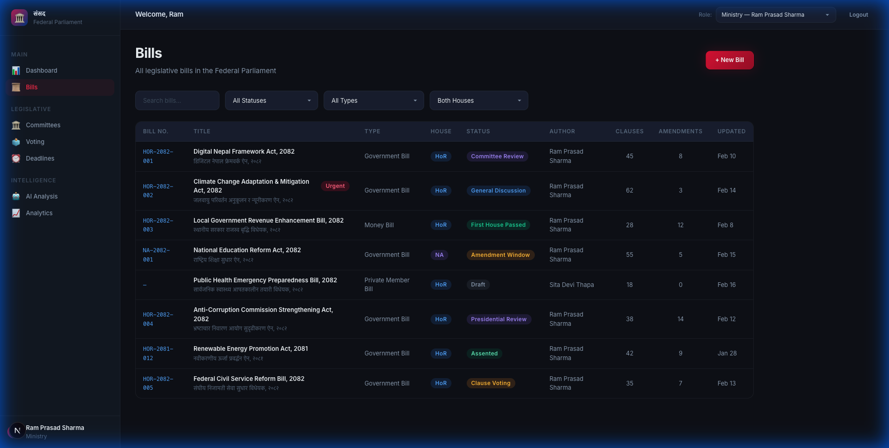
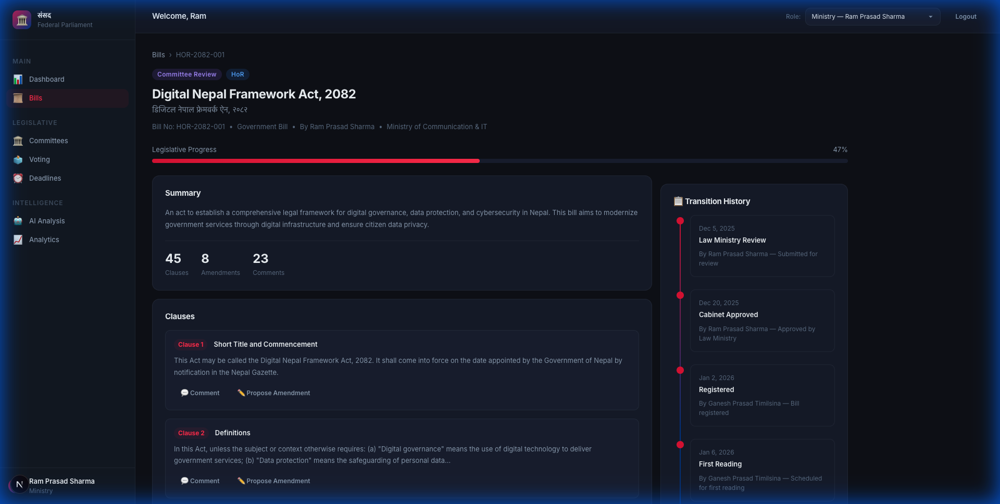
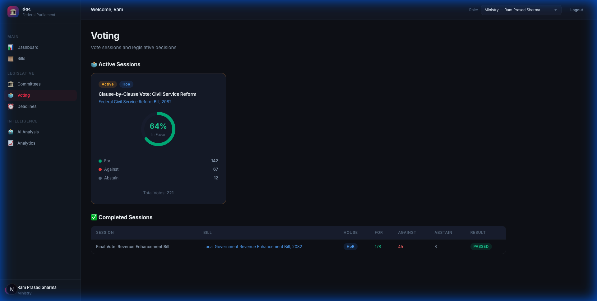

# 🏛️ Nepal Federal Legislative Management & AI Legal Intelligence System

> संघीय संसद - Federal Parliament of Nepal

A full-stack legislative management system for Nepal's Federal Parliament, covering the entire bill lifecycle from drafting to gazette publication. Built with a Nepal-inspired dark glassmorphism design theme.

## Screenshots

### Login
Role-based demo login with Nepal Parliament branding (संघीय संसद) supporting 8 user roles.



### Dashboard
Stats overview, recent bills with status badges, upcoming deadlines with urgency indicators, and activity timeline.



### Bills Listing
Searchable & filterable table with bill numbers, titles (EN/NE), type, house badge, status, author, clauses, amendments, and last update.



### Bill Detail
Breadcrumb navigation, lifecycle progress bar, bill summary, clause-by-clause viewer with comment/amendment actions, and transition history timeline.



### Voting
Active sessions with SVG donut chart visualization, vote breakdown (For/Against/Abstain), and completed sessions table.



### Other Pages
- **Committees** - Grid cards with member counts and active bills
- **Deadlines** - Urgency-coded cards with countdown timers and constitutional rules reference
- **Secretariat** - Registration, scheduling, and gazette publication queues
- **Presidential** - Assent/return workflow with deadline countdowns
- **AI Analysis** - Compliance scoring, constitutional conflict detection, affected acts analysis
- **Analytics** - Bill status charts, house distribution donut, voting patterns, committee performance
- **New Bill Form** - Multi-step wizard (basic info → clauses → review)

---

## Tech Stack

| Layer | Technology |
|-------|-----------|
| Framework | Next.js 16 (App Router, Turbopack) |
| Language | TypeScript |
| ORM | Prisma (PostgreSQL) |
| State Machine | Custom 20-state bill lifecycle engine |
| Auth | Demo localStorage (SSO planned for production) |
| Styling | Custom CSS design system |

## Architecture

```
src/
├── app/                          # Next.js App Router pages
│   ├── login/                    # Role-based login
│   ├── dashboard/                # Authenticated layout
│   │   ├── bills/                # Bills listing & detail
│   │   │   ├── [id]/             # Dynamic bill detail
│   │   │   └── new/              # New bill creation form
│   │   ├── committees/           # Committee management
│   │   ├── voting/               # Voting sessions
│   │   ├── deadlines/            # Constitutional deadlines
│   │   ├── secretariat/          # Secretariat workflows
│   │   ├── presidential/         # Presidential actions
│   │   ├── ai/                   # AI Legal Intelligence
│   │   └── analytics/            # Analytics dashboard
│   └── globals.css               # Design system
├── components/
│   ├── layout/                   # Sidebar, Topbar
│   └── providers/                # AuthProvider
├── lib/
│   ├── auth.ts                   # Demo authentication (8 roles)
│   ├── mock-data.ts              # Mock data layer
│   ├── prisma.ts                 # Database client
│   ├── state-machine/            # Bill lifecycle state machine
│   └── rules-engine/             # Constitutional deadline rules
├── types/                        # TypeScript type definitions
└── prisma/
    └── schema.prisma             # 20+ database models
```

## Key Features

### 🔄 Bill Lifecycle State Machine
20 states covering the complete legislative process - from `DRAFT` → `LAW_MINISTRY_REVIEW` → `CABINET_APPROVED` → ... → `PRESIDENTIAL_REVIEW` → `ASSENTED` → `GAZETTE_PUBLISHED`. Each transition has role-based guards, quorum requirements, and side effects.

### 👥 Role-Based Access
8 roles: Ministry, MP, Committee Member, Secretariat, Speaker, President, Admin, Public - each with specific permissions and route visibility.

### ⏱️ Constitutional Deadline Engine
Automated tracking of time-bound legislative requirements (e.g., 15-day presidential assent, 2-month NA bill return) with urgency levels and countdown timers.

### 🤖 AI Legal Intelligence
Constitutional compliance scoring, conflict detection against existing acts, and risk assessment for proposed legislation.

## Getting Started

### Prerequisites
- Node.js 18+ or Bun
- PostgreSQL (optional - mock data layer works without it)

### Install & Run

```bash
# Install dependencies
bun install
# or: npm install

# Run development server
bun dev
# or: npm run dev
```

Open [http://localhost:3000](http://localhost:3000) - you'll be redirected to the login page where you can select a demo role.

### Production Build

```bash
bun run build
# or: npm run build
```

## License

MIT
